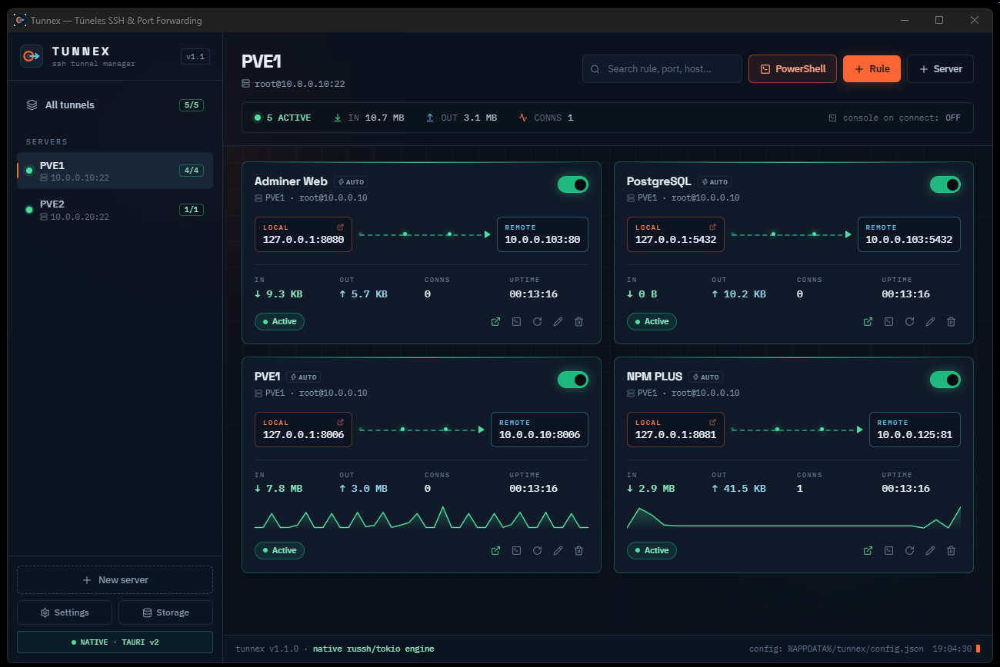

# Tunnex — Visual SSH Tunnel & Local Port Forwarding Manager

<p align="center">
  
</p>

<p align="center">
  <strong>Tunnex</strong> is a high-performance, native Windows application built with <strong>Tauri v2</strong>, <strong>Rust</strong>, and <strong>React 19</strong> designed to manage SSH profiles and local port forwarding rules with live real-time telemetry, native Windows Credential Manager security, and one-click browser integration.
</p>

<p align="center">
  <a href="https://github.com/jaimitus/Tunnex/releases/tag/v1.0.0"></a>
  <a href="https://github.com/jaimitus/Tunnex"></a>
  </a>
  </a>
</p>

---

## 📥 Download Release (v1.0.0)

Download pre-compiled Windows binaries from the official [v1.0.0 Release Page](https://github.com/jaimitus/Tunnex/releases/tag/v1.0.0):

<p align="center">
  <a href="https://github.com/jaimitus/Tunnex/releases/download/v1.0.0/Tunnex_1.0.0_x64-setup.exe"></a>
  <a href="https://github.com/jaimitus/Tunnex/releases/download/v1.0.0/Tunnex_1.0.0_x64_en-US.msi"></a>
  <a href="https://github.com/jaimitus/Tunnex/releases/download/v1.0.0/tunnex.exe"></a>
</p>

| Package | Format | Direct Download Link |
| :--- | :--- | :--- |
| **NSIS Setup Installer** *(Recommended)* | `.exe` | [Tunnex_1.0.0_x64-setup.exe](https://github.com/jaimitus/Tunnex/releases/download/v1.0.0/Tunnex_1.0.0_x64-setup.exe) |
| **MSI Package** | `.msi` | [Tunnex_1.0.0_x64_en-US.msi](https://github.com/jaimitus/Tunnex/releases/download/v1.0.0/Tunnex_1.0.0_x64_en-US.msi) |
| **Standalone Portable** | `.exe` | [tunnex.exe](https://github.com/jaimitus/Tunnex/releases/download/v1.0.0/tunnex.exe) |

---

## ✨ Core Features

- **🚀 Async SSH Tunnel Engine (`direct-tcpip`)**: Powered by `tokio` multi-threaded async runtime and `russh` SSH stack. Each forwarded local port (`127.0.0.1:<local_port>`) opens real-time SSH channels to the remote service.
- **🔐 Hardware-grade Credential Storage (DPAPI)**: Passwords and private key passphrases are never saved in JSON files. They are securely encrypted and stored using the **Windows Credential Manager** (`keyring` under the `tunnex` service).
- **🌐 One-Click Browser Launch**: Click on any local endpoint (`127.0.0.1:<port>`) or the browser button to instantly open target web services (Adminer, PostgreSQL Web, Redis UI, etc.) in your system's default browser.
- **🖥️ Native Windows PowerShell Integration**: Launch detached PowerShell, PowerShell Core 7 (`pwsh`), or Windows Terminal (`wt.exe`) windows pre-configured with active SSH sessions (`ssh -p <port> -i <key> user@host`) or diagnostic scripts (`Test-NetConnection`).
- **📊 Real-time Traffic Telemetry & Sparklines**: Monitor live throughput (bytes sent/received), active connections, and session uptime with smooth SVG sparkline charts.
- **📌 System Tray Context Menu**: Minimize to tray with active background tunnels. Manage global connections (*Conectar todo*, *Desconectar todo*, *Abrir PowerShell*, *Salir*) directly from the tray context menu.

---

## 🛠️ Technology Stack

| Layer | Technology |
| :--- | :--- |
| **Desktop Framework** | [Tauri v2](https://tauri.app) (Native Windows Windowing & System Tray) |
| **Backend Language** | [Rust](https://www.rust-lang.org/) (`x86_64-pc-windows-msvc`) |
| **Async Runtime** | [Tokio](https://tokio.rs/) & [Russh](https://github.com/warp-tech/russh) |
| **Security** | Windows Credential Manager (`keyring` / DPAPI) |
| **Frontend Framework** | [React 19](https://react.dev/) + [TypeScript](https://www.typescriptlang.org/) |
| **Styling & Icons** | [Tailwind CSS v4](https://tailwindcss.com/) + [Lucide Icons](https://lucide.dev/) |

---

## 🚀 Getting Started & Building from Source

### Prerequisites

1. **Node.js** (v18+ recommended)
2. **Rust Toolchain** with `x86_64-pc-windows-msvc`:
   ```powershell
   rustup default stable-x86_64-pc-windows-msvc
   ```

### Installation & Development

```powershell
# Clone the repository
git clone https://github.com/jaimitus/Tunnex.git
cd Tunnex

# Install node dependencies
npm install

# Run application in development mode
npx tauri dev
```

### Production Build (`.exe` & Installers)

To compile the standalone production executable and installer bundles:

```powershell
# Generate application icons
npx @tauri-apps/cli icon src-tauri/icons/icon.png

# Build release bundle
npx tauri build
```

---

## 📁 Configuration & Logs

- **Configuration File**: `%APPDATA%\tunnex\config.json` (saved atomically)
- **Windows Credential Service**: `tunnex` (Windows Credential Manager)

---

## 📄 Repository & License

- **GitHub Repository**: [https://github.com/jaimitus/Tunnex](https://github.com/jaimitus/Tunnex)
- **Official Releases**: [https://github.com/jaimitus/Tunnex/releases](https://github.com/jaimitus/Tunnex/releases)
- **License**: MIT License © [jaimitus](https://github.com/jaimitus)
